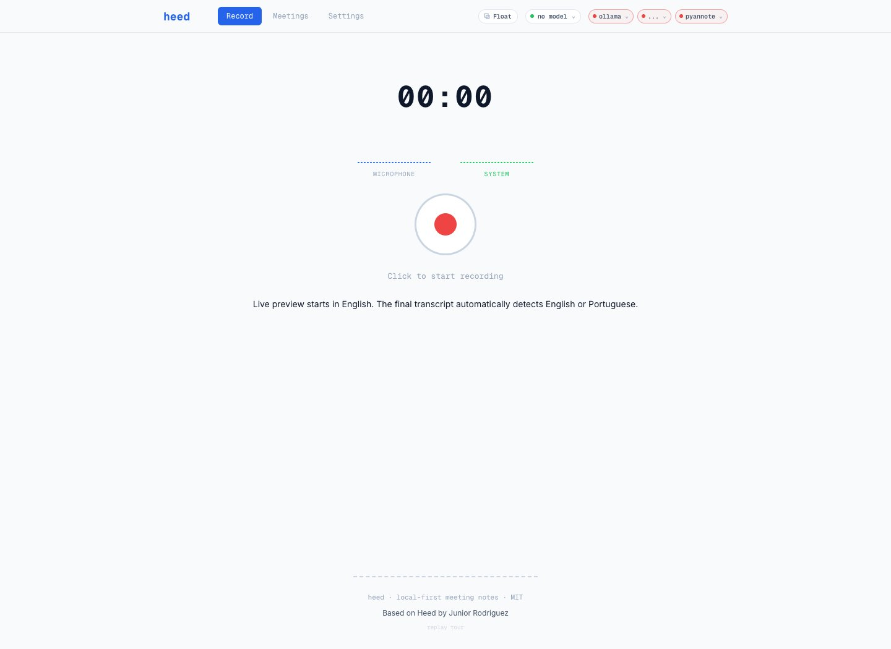
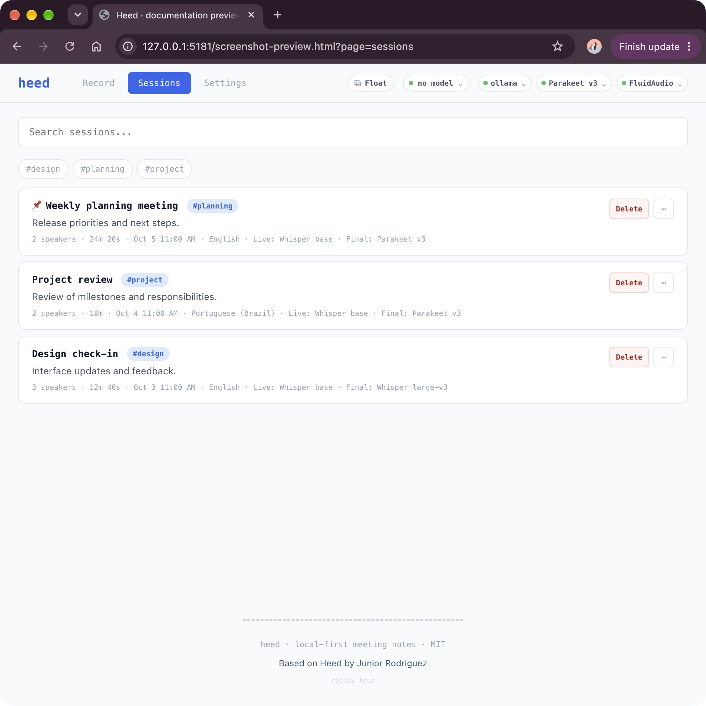
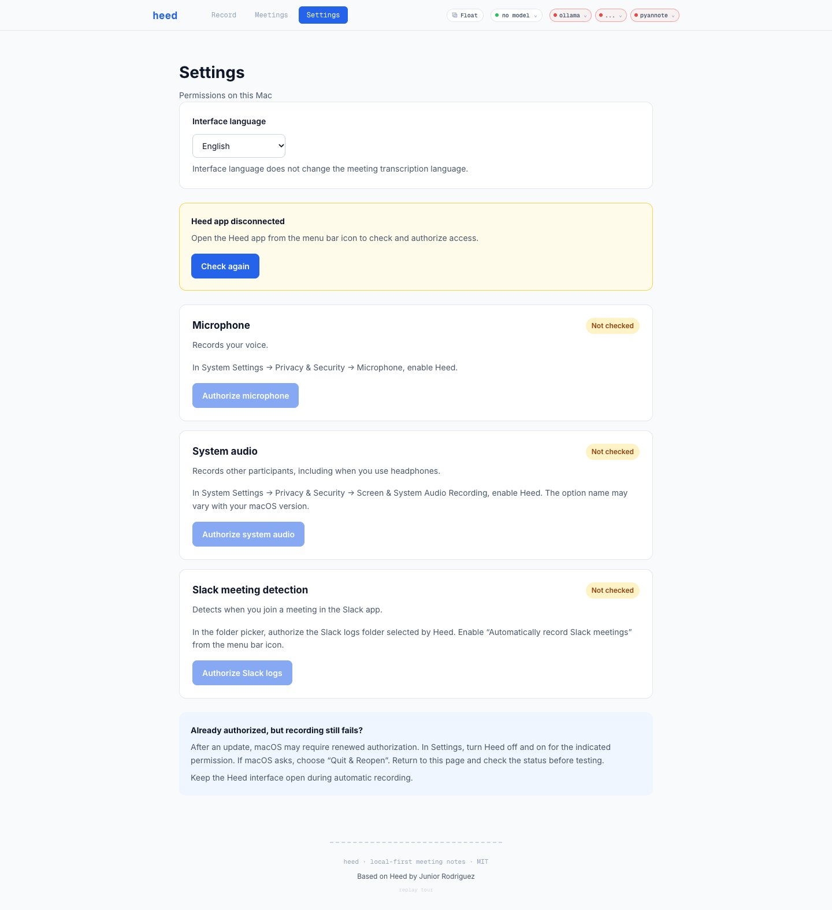
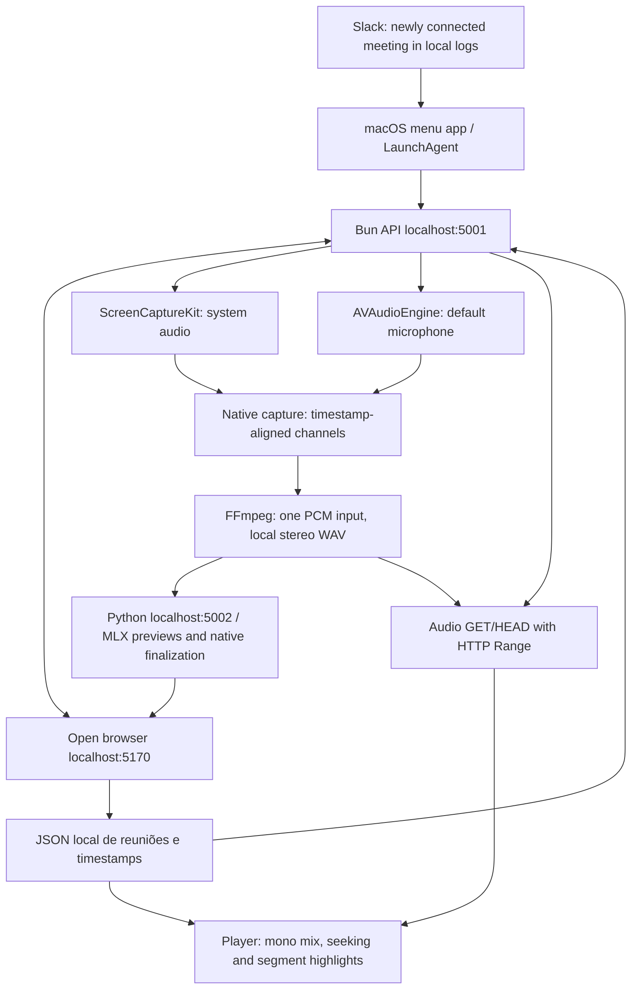

# Heed macOS

Adaptação do [Heed](https://github.com/isjunrod/heed), de Junior Rodriguez, para gravar e transcrever reuniões localmente em **português do Brasil (`pt`) e inglês (`en`)**. Inclui controles na barra de menus, retenção de áudio de 2 GB e reprodução sincronizada com a transcrição. A interface e o menu oferecem inglês, português do Brasil, francês e alemão, com fallback para inglês. O idioma final da reunião é detectado automaticamente.

Cada Mac mantém seus próprios áudios, modelos e reuniões. Instalar o projeto em duas máquinas oferece os mesmos recursos, mas **não sincroniza arquivos entre elas nem envia reuniões à nuvem**.

## Credits and upstream

Este projeto é baseado no **[Heed](https://github.com/isjunrod/heed)**, criado por **[Junior Rodriguez (@isjunrod)](https://github.com/isjunrod)**. O Heed fornece a base original de transcrição local, identificação de participantes, reuniões salvas e notas com IA.

This repository maintains additional macOS controls, Slack automation, audio retention, permission guidance, transcript playback, and interface localization. The original MIT license and copyright notice are preserved in [LICENSE](LICENSE). See [CREDITS.md](CREDITS.md) for attribution and project links.

## Screenshots

The screenshots below use demonstration meeting data.

### Recording



### Reuniões



### Settings



## Contributing

Contributions through forks and pull requests are welcome. Only @augustocbx can merge into the default branch. See [CONTRIBUTING.md](CONTRIBUTING.md).

## Installation

Requirements: **Apple Silicon**, **macOS 14 or later**, [Homebrew](https://brew.sh), and Apple's Command Line Tools. The installer also installs Node.js for the Vite interface. A minimum RAM requirement has not been validated across all Macs.

Install Command Line Tools if needed, then clone and install:

```sh
xcode-select --install
git clone https://github.com/augustocbx/heed-macos.git
cd heed-macos
bash install-macos.sh
```

The installer prepares Bun, Node.js, FFmpeg, Python and its `.venv`, dependencies, Swift executables, the interface, and the menu app. **Bun 1.4.2** is the version used for validation; the installer downloads Bun if it is missing. Initial preparation downloads the local FluidAudio/Parakeet models. The measured model set takes approximately **1.7 GB of additional disk space**, outside the audio quota. Installation and the initial download require an internet connection.

Ollama is also installed for AI notes. Its models are optional and are not downloaded automatically; transcription does not require a notes model. Do not run this installer with `sudo`.

## Permissions and use

The app is installed at `~/Applications/Heed.app`. The LaunchAgent at `~/Library/LaunchAgents/local.heed.menubar.plist` starts the menu icon when you log in. Use the menu to start or stop recording and open [http://localhost:5170](http://localhost:5170).

### Automatic start for Slack meetings

**Automatically record Slack meetings** is enabled by default in the menu. With Heed already running, joining a meeting/huddle in the **installed Slack app** starts recording after a few seconds of confirmation. Opening Slack, preparing a meeting, or testing the microphone does not start capture. Every recording starts with an English live preview; audio permissions and models must be ready.

If macOS blocks access to Slack logs, Heed opens a folder picker. Select the exact **logs** folder and click **Allow log access**. To request access again, choose **Allow Slack log access…** from the menu. The App Store version uses `~/Library/Containers/com.tinyspeck.slackmacgap/Data/Library/Application Support/Slack/logs`; the directly downloaded version uses `~/Library/Application Support/Slack/logs`. The picker opens at the expected location; use **⌘⇧G** to enter the path if needed. Access is limited to that folder and stored as a read-only security-scoped bookmark for future launches. Full Disk Access is not required. Authorize the folder separately on each Mac. The menu should show **Slack: waiting for the next meeting** before testing.

If the interface is closed, Heed opens `localhost:5170` and waits for it to connect before sending the start command. Keep that tab open for transcription and saving. A confirmed Slack meeting end stops recording automatically. An unavailable detector does not stop capture. You can also stop recording through Heed's menu. A manual stop does not restart recording for the same meeting.

The detector follows only new meeting states in local Slack logs, without storing messages or channel names. A meeting already active when Heed starts therefore does not trigger recording retroactively. The menu shows the detector state; diagnostics are written to `~/Library/Logs/Heed/slack-auto.log`. Slack's internal log format may change in future releases. Slack in a browser is not monitored.

**Mantenha a aba da interface aberta durante a captura e o salvamento.** Ela pode ficar minimizada. O navegador controla a gravação, recebe a transcrição ao vivo e salva a reunião quando a captura termina.

Open **Settings** in the interface or **Settings and permissions…** from the menu. The page queries the native app and shows microphone, system audio, and Slack log access status. Its buttons request access or open the corresponding System Settings section. Status refreshes when you return to the page and every three seconds; without a connection to the menu app, permission status is unknown. System Settings buttons remain available for permissions that appear enabled, so an authorization invalidated by macOS can be renewed.

In **System Settings → Privacy & Security**, allow:

- **Screen & System Audio Recording**, to capture other participants.
- **Microphone**, to capture your voice.

macOS may display Heed, Bun, or the capture component as the requesting app. If no prompt appears, check these settings manually. The capture executable is `<project-folder>/packages/transcription/native/heed-parakeet/.build/release/heed-syscap`. Each Mac needs its own permissions.

Updating the locally signed app may invalidate its previous authorization. If capture is denied even though Heed appears enabled, turn its **Screen & System Audio Recording** permission off and on again, then accept the restart requested by macOS. Slack log access remains a separate folder-picker authorization.

System audio capture uses ScreenCaptureKit and works with headphones. Microphone capture uses the default macOS input: check **System Settings → Sound → Input** before a meeting.

### Isolamento de Voz do macOS e captura do Heed

Em uma chamada de teste em um app compatível, como o FaceTime, abra o menu **Vídeo** ou **Áudio** na barra de menus do macOS e selecione **Modo do Microfone → Isolamento de Voz**. No macOS 14 ou posterior, esse é o caminho documentado pela [Apple](https://support.apple.com/pt-br/105117). Em chamadas somente de áudio no [FaceTime](https://support.apple.com/guide/facetime/change-audio-options-fctme7c07113/mac), **Isolamento de Voz** pode aparecer diretamente no menu **Áudio**. Confira qual app aparece no menu antes de alterar o modo. **Isolamento de Voz** prioriza sua fala e reduz ruídos próximos; **Padrão (Standard)** retorna ao processamento padrão, sem prometer áudio sem tratamento. As opções [variam conforme o app](https://support.apple.com/en-gb/guide/mac-help/mchle82b42f0/mac).

A disponibilidade também depende do dispositivo de entrada e da rota de áudio: a Apple distingue o modo solicitado daquele [efetivamente usado pela rota atual](https://developer.apple.com/videos/play/wwdc2021/10047/). Se o controle estiver ausente ou indisponível, registre o app, o microfone e a versão do macOS; isso não comprova falha do Heed nem exige mudanças nas permissões.

Os caminhos de áudio têm funções diferentes:

- **Sua voz enviada à chamada:** o modo do microfone atua no caminho do app compatível usado para conversar. Escolher Isolamento de Voz no Slack não comprova que o microfone capturado separadamente pelo Heed recebe o mesmo tratamento.
- **Voz dos demais participantes:** chega pela saída de áudio do app. O Heed a grava com ScreenCaptureKit, inclusive usando fones; o modo do seu microfone não remove o ruído recebido dos outros participantes.
- **Gravação e transcrição:** o Heed captura seu microfone com AVAudioEngine e preserva as fontes em canais separados. A preparação do áudio para reconhecimento de fala (ASR), como conversão de formato e taxa de amostragem, não altera o áudio enviado aos participantes. O Heed não oferece dispositivos virtuais selecionáveis de microfone ou alto-falante. Isolamento de Voz não equivale ao conjunto de recursos e [roteamento do Krisp](https://help.krisp.ai/hc/en-us/articles/30533083171868-Noise-Cancellation-with-Krisp-AI-Meeting-Assistant).

Para comparar, use uma chamada curta sem conteúdo privado, fora de reuniões importantes. Anote o modo inicial; fale a mesma frase com ruído leve em **Padrão** e em **Isolamento de Voz**, peça ao interlocutor que compare e restaure o modo inicial. Avalie a gravação do Heed separadamente. Consulte [permissões](#permissions-and-use), [reprodução](#playback-with-the-transcript) e [diagnóstico](#diagnostics-and-tests).

**Validação pendente:** MacBook Air M1 e MacBook Pro M4 Pro, ambos com macOS 27.0.1 conforme o contexto informado. Este texto não relata testes nesses Macs nem valida todas as versões compatíveis com macOS 14+.

## Playback with the transcript

Abra **Meetings** (ou **Reuniões**, na interface em português), escolha uma reunião e pressione Play no reprodutor acima da transcrição. O trecho correspondente é destacado e mantido visível. Clique em um trecho, ou use Enter/Espaço, para reproduzir daquele ponto. Falas sobrepostas podem destacar vários trechos. A sincronização segue os tempos dos trechos, sem precisão por palavra.

The original WAV preserves two separate channels at 16 kHz: **left = microphone; right = system audio**. This lets transcription process the sources separately. Heed's player mixes the channels to mono so you hear both sources in both ears; another player may retain the original left/right separation.

Os nomes atribuídos manualmente durante a gravação são preservados nas atualizações da transcrição e salvos com a reunião. Renomear após a gravação ou em **Meetings / Reuniões** também atualiza os trechos e a lista de participantes no arquivo local. Quando a identificação final reorganiza os participantes, os nomes são transferidos pelos canais de origem e pelos trechos sobrepostos; correspondências ambíguas não são forçadas pelo número de “Speaker”.

If microphone quality drops with Bluetooth headphones, select the **Mac's built-in microphone as input** while keeping the headphones as output. Apple explains the Bluetooth mode change in [If sound quality is reduced when using Bluetooth headphones with your Mac](https://support.apple.com/en-ie/102217).

## Storage and retention

Os arquivos de áudio ficam na pasta `recordings/` deste checkout. As reuniões e transcrições ficam em `~/.heed-app/sessions/`; a configuração, em `~/.heed-app/`. Os modelos ficam em `~/Library/Application Support/FluidAudio/Models/`.

A cota por máquina é de **2.000.000.000 bytes**, contando os arquivos de áudio elegíveis em `recordings/`, inclusive os arquivados nessa pasta. Quando necessário, os áudios mais antigos são excluídos primeiro. O texto da transcrição é preservado, e a interface indica quando o áudio de uma reunião não está mais disponível.

Capture and processing need temporary disk space. A continuous recording therefore has an output limit of approximately **990 MB**, reserving space to split and process its channels. Reaching this limit stops and saves the recording. Models, the Python environment, and dependencies are outside the audio quota.

Do not copy `recordings/`, `.venv`, or `~/.heed-app/` to install on another Mac. Run the installer on that machine instead.

## Architecture



O menu envia comandos à API local. A interface aberta os recebe e coordena a captura, a transcrição e o salvamento da reunião. On macOS, one native executable combines ScreenCaptureKit and AVAudioEngine, preserves each channel's timestamps, and supplies one PCM stream to FFmpeg. Recording starts only after the microphone supplies stable audio. The Python service uses MLX Whisper base for bounded live previews. At stop, a short-lived tiny Whisper worker detects English or Portuguese, and a temporary native Parakeet sidecar retranscribes the full audio with timestamps. FluidAudio handles diarization. Manual retranscription can instead use a selected Whisper model in an isolated worker. The installer caches the base and tiny models; additional models download on first use. MLX Whisper declares a Torch package dependency, which is installed even though live inference uses MLX. Pyannote and faster-whisper are optional fallback dependencies. Live voice names are reconciled without assuming speaker numbers stay unchanged. The `/api/sessions/:id/audio` endpoint serves only authorized local files, using GET/HEAD and HTTP Range for seeking without loading the entire file. Highlighting follows the player's actual time and the saved segment timestamps.

## Updates

Pare a gravação e aguarde o término do salvamento da reunião antes de atualizar **cada Mac**:

```sh
git pull --ff-only
bash install-macos.sh
```

The installer checks for active capture, commands, or processing and refuses to restart in that state. It preserves local files and reinstalls the app. If you move the checkout, run it again to update the project path used by the menu app.

## Diagnostics and tests

Services are local: interface **5170**, Bun API **5001**, Python transcription **5002**, and Ollama **11434**. Logs are stored in `~/Library/Logs/Heed/`.

```sh
curl -fsS http://localhost:5001/api/desktop/control/status
curl -fsS http://localhost:5001/api/sessions
curl -fsS http://localhost:11434/api/tags
bun run doctor
bun test packages/server/lib
python3 -m unittest discover -s packages/transcription -p voice_identity_test.py
NODE_OPTIONS=--no-experimental-webstorage bun run --cwd packages/client test --run
bun run build
bash packages/desktop/install-menubar.sh --build-only
```

O status de controle informa `recording`, `processing`, `pending`, `starting`, `ready` e a conexão da interface. Se ela estiver desconectada, reabra `http://localhost:5170`. Para uma reunião existente, `curl -I http://localhost:5001/api/sessions/ID/audio` verifica a disponibilidade e os metadados sem baixar o áudio.

## Known limitations

Automatic start on macOS supports new meetings in the installed Slack app. Automatic start and stop for Google Meet, Microsoft Teams, and Zoom are not implemented. The original PipeWire-based detector remains Linux-specific.

The previous capture path could discard microphone buffers while combining two FFmpeg inputs, shortening the file and cutting speech. Unified native capture replaces that path. Older recordings may still contain missing audio; this correction applies to new recordings. Playback uses the file's actual duration. Audio that was never captured or was deleted cannot be reconstructed from the transcript.

## Credits and license

Based on [isjunrod/heed](https://github.com/isjunrod/heed), by Junior Rodriguez. The original MIT license is preserved in [LICENSE](LICENSE), and upstream documentation is preserved in [README-upstream.md](README-upstream.md). This fork contains the macOS adaptations maintained at [augustocbx/heed-macos](https://github.com/augustocbx/heed-macos). See also [README-macos.md](README-macos.md).

### Live preview and final transcript

Cada gravação começa com uma prévia em inglês usando um modelo menor e janelas limitadas para reduzir o processamento e a memória. A prévia é provisória. Ao parar, o Heed detecta inglês ou português em amostras do áudio salvo e sempre retranscreve a gravação inteira com o modelo final de maior precisão. A reunião salva usa o idioma detectado e os tempos do áudio completo, preservando nomes atribuídos manualmente quando a correspondência é inequívoca. Se a etapa final falhar, o áudio continua disponível para recuperação; a recuperação também detecta o idioma e processa o áudio completo, em vez de salvar a prévia.

## Interface localization

Use **Settings → Interface language** or the menu bar language submenu. English, Portuguese (Brazil), French, and German are available. Unsupported locales and missing translations fall back to English. The per-Mac preference is shared by the menu and interface tabs and remains independent of the English/Portuguese transcription language.
