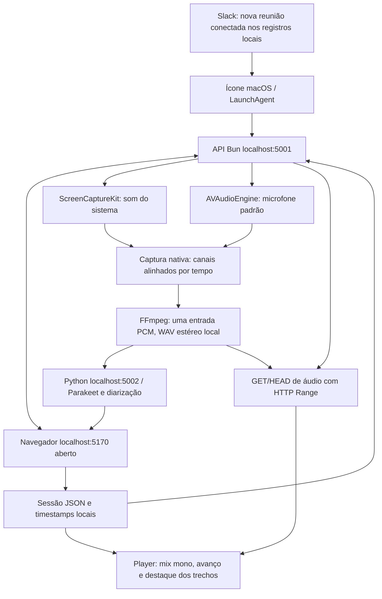

# Heed macOS

Personalização do [Heed](https://github.com/isjunrod/heed), de Junior Rodriguez, para gravar e transcrever reuniões localmente em **português brasileiro (`pt`) e inglês (`en`)**. Inclui controles na barra superior, retenção de áudio de 2 GB e reprodução sincronizada com a transcrição.

Cada Mac mantém seus próprios áudios, modelos e sessões. Instalar o mesmo projeto em duas máquinas oferece o mesmo funcionamento, mas **não sincroniza arquivos entre elas nem envia reuniões para a nuvem**.

## Instalação

Requer Mac com **Apple Silicon**, **macOS 14 ou posterior**, [Homebrew](https://brew.sh), Command Line Tools. O script instala também Node.js para a interface Vite. Não há um mínimo de RAM validado para todos os Macs.

```sh
xcode-select --install
git clone https://github.com/augustocbx/heed-macos.git
cd heed-macos
bash install-macos.sh
```

O instalador prepara Bun, Node.js, FFmpeg, Python e seu ambiente `.venv`, dependências, executáveis Swift e o aplicativo do menu. A versão de Bun usada na validação é **1.4.2**; o instalador baixa Bun se ele estiver ausente. Os modelos locais FluidAudio/Parakeet são baixados na preparação inicial: o conjunto medido ocupa aproximadamente **1,7 GB adicionais**, fora da cota dos áudios. A instalação e o primeiro download exigem internet.

Ollama também é instalado para notas por IA. Seus modelos são opcionais e não são baixados automaticamente; a transcrição não depende de um modelo de notas. Não é necessário executar o instalador com `sudo`.

## Permissões e uso

O aplicativo fica em `~/Applications/Heed.app`. O LaunchAgent `~/Library/LaunchAgents/local.heed.menubar.plist` inicia o ícone ao entrar no macOS. Pelo menu, escolha **Português** ou **English**, inicie/pare a gravação e abra [http://localhost:5170](http://localhost:5170).

### Início automático no Slack

**Gravar automaticamente reuniões do Slack** vem habilitado no menu do ícone. Com o Heed já aberto, entrar em uma reunião/huddle no **aplicativo Slack instalado** inicia a gravação após alguns segundos de confirmação. Abrir o Slack, preparar uma reunião ou testar o microfone não inicia a captura. O idioma é o escolhido no menu; as permissões de áudio e os modelos precisam estar prontos.

Se a interface estiver fechada, o Heed abre `localhost:5170` e espera a conexão antes de enviar o comando. Mantenha essa aba aberta para transcrever e salvar. **Pare a gravação pelo menu do Heed**; sair da reunião não encerra a captura automaticamente. Se parar manualmente, a mesma reunião não reinicia a gravação.

A detecção acompanha apenas novos estados de reunião dos registros locais do Slack, sem armazenar mensagens ou nomes de canais. Por isso, uma reunião que já estava ativa quando o Heed abriu não dispara retroativamente. O estado do monitor aparece no menu; o diagnóstico fica em `~/Library/Logs/Heed/slack-auto.log`. Os registros são uma implementação interna do Slack e podem mudar em futuras versões. O Slack no navegador não é monitorado.

**Mantenha a aba da interface aberta durante a captura e o salvamento.** Ela pode ficar minimizada. O navegador executa o controle da gravação, acompanha a transcrição e salva a sessão quando a captura termina.

Em **Ajustes do Sistema → Privacidade e Segurança**, autorize:

- **Gravação de Tela e Áudio do Sistema**, para capturar os outros participantes.
- **Microfone**, para capturar sua voz.

O nome apresentado pelo macOS pode ser Heed, Bun ou o componente de captura. Se não surgir um pedido, confira essas telas manualmente. O capturador está em `<pasta-do-projeto>/packages/transcription/native/heed-parakeet/.build/release/heed-syscap`. Cada Mac precisa de suas próprias autorizações.

A captura do som do sistema usa ScreenCaptureKit e funciona com fones de ouvido. O microfone usa a entrada padrão do macOS: confira **Ajustes do Sistema → Som → Entrada** antes da reunião.

## Ouvir com a transcrição

Abra **Sessions**, escolha a reunião e pressione Play no player acima da transcrição. O trecho correspondente ao áudio fica destacado e visível. Clique no trecho, ou use Enter/Espaço, para ouvir a partir dele. Falas simultâneas podem ficar destacadas juntas; a sincronização é por trecho, não palavra por palavra.

O WAV original mantém dois canais separados: **esquerdo = microfone; direito = som do sistema**, a 16 kHz. Isso permite processar as vozes separadamente. O player mistura esses canais em mono para ouvir ambos dos dois lados; abrir o arquivo original em outro player mantém a separação esquerda/direita.

Nomes escolhidos manualmente na tela de gravação permanecem durante as atualizações da transcrição e são salvos na sessão. Renomear depois da gravação ou em **Sessions** também atualiza os segmentos e a lista de participantes no arquivo local. Quando a diarização final reorganiza os falantes, o nome é transferido pela origem e pela sobreposição dos trechos; correspondências ambíguas não são forçadas pelo número de “Speaker”.

Se a qualidade cair ao usar o microfone de um fone Bluetooth, selecione o **microfone integrado do Mac como entrada**, mantendo o fone como saída. A Apple explica essa mudança de qualidade em [Se a qualidade do som dos fones Bluetooth estiver reduzida](https://support.apple.com/en-ie/102217).

## Armazenamento e retenção

Os arquivos de áudio ficam em `recordings/`, dentro deste checkout. Sessões e transcrições ficam em `~/.heed-app/sessions/`; configurações ficam em `~/.heed-app/`. Modelos ficam em `~/Library/Application Support/FluidAudio/Models/`.

A cota por máquina é **2.000.000.000 bytes**, somando os arquivos de áudio elegíveis de `recordings/`, incluindo arquivos arquivados nessa pasta. Quando necessário, os áudios mais antigos são apagados; o texto da transcrição é preservado. A interface informa quando o áudio não está mais disponível.

A captura e o processamento precisam de espaço temporário. Por isso, uma gravação contínua tem limite de saída de aproximadamente **990 MB**, reservando espaço para separar e processar os canais. Ao alcançar esse limite, ela é encerrada e salva. Os modelos, o ambiente Python e as dependências não fazem parte da cota de áudio.

Não copie `recordings/`, `.venv` ou `~/.heed-app/` para instalar em outro Mac; execute o instalador naquela máquina.

## Como funciona



O menu envia comandos à API local; a interface aberta recebe esses comandos e mantém o fluxo de captura, transcrição e salvamento. No macOS, um único capturador nativo reúne ScreenCaptureKit e AVAudioEngine, preserva o tempo de cada canal e entrega um fluxo PCM ao FFmpeg. A gravação só começa depois que o microfone entrega áudio estável. O serviço Python coordena os sidecars Swift/FluidAudio: ASR com Parakeet, diarização e finalização. Os nomes reconhecidos ao vivo são reaproveitados por compatibilidade de voz, sem supor que a numeração dos participantes permaneça igual. O endpoint `/api/sessions/:id/audio` serve apenas arquivos locais autorizados, com GET/HEAD e HTTP Range para avançar sem carregar o arquivo inteiro. O destaque acompanha o tempo real do player e os timestamps de cada segmento.

## Atualização

Pare a gravação e aguarde o salvamento antes de atualizar, em **cada Mac**:

```sh
git pull --ff-only
bash install-macos.sh
```

O instalador verifica se há captura, comando ou processamento ativo e recusa reiniciar nesse caso. Ele preserva os arquivos locais e reinstala o aplicativo. Se mover o checkout, execute novamente para atualizar o caminho usado pelo ícone.

## Diagnóstico e testes

Os serviços são locais: interface **5170**, API Bun **5001**, transcrição Python **5002** e Ollama **11434**. Logs ficam em `~/Library/Logs/Heed/`.

```sh
curl -fsS http://localhost:5001/api/desktop/control/status
curl -fsS http://localhost:5001/api/sessions
curl -fsS http://localhost:11434/api/tags
bun run doctor
bun test packages/server/lib
python3 -m unittest discover -s packages/transcription -p voice_identity_test.py
NODE_OPTIONS=--no-experimental-webstorage bun run --cwd packages/client test --run
bun run build
```

O status permite verificar `recording`, `processing`, `pending`, `starting`, `ready` e a conexão da interface. Se ela estiver desconectada, abra novamente `http://localhost:5170`. Para uma sessão existente, `curl -I http://localhost:5001/api/sessions/ID/audio` verifica disponibilidade e metadados sem baixar o áudio.

## Limitações conhecidas

O início automático no macOS está disponível para novas reuniões no aplicativo Slack. O encerramento automático e a detecção de Google Meet, Microsoft Teams e Zoom ainda não foram implementados. O detector original baseado em PipeWire continua sendo específico do Linux.

A captura anterior podia descartar blocos do microfone ao combinar duas entradas no FFmpeg, encurtando o arquivo e cortando a fala. A captura nativa unificada substitui esse caminho. Arquivos antigos podem continuar com trechos ausentes; a correção se aplica a novas gravações. O player usa a duração real do arquivo. Áudio que não foi capturado ou que foi apagado não pode ser recuperado a partir da transcrição.

## Créditos e licença

Baseado no [isjunrod/heed](https://github.com/isjunrod/heed), de Junior Rodriguez. A licença MIT original está preservada em [LICENSE](LICENSE), e a documentação original em [README-upstream.md](README-upstream.md). Este fork reúne as adaptações de macOS mantidas em [augustocbx/heed-macos](https://github.com/augustocbx/heed-macos). Veja também [README-macos.md](README-macos.md).
