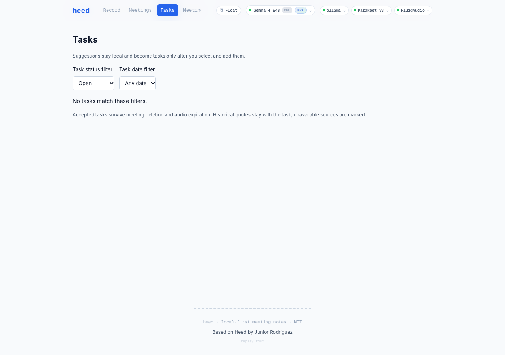
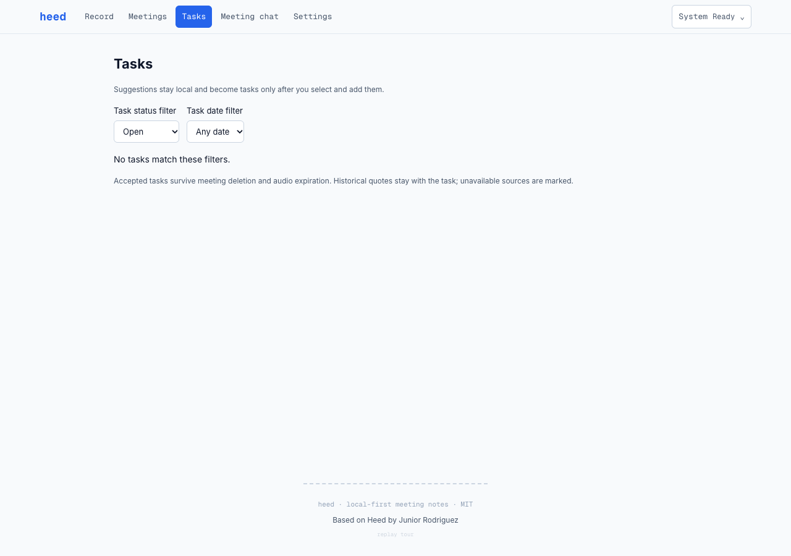
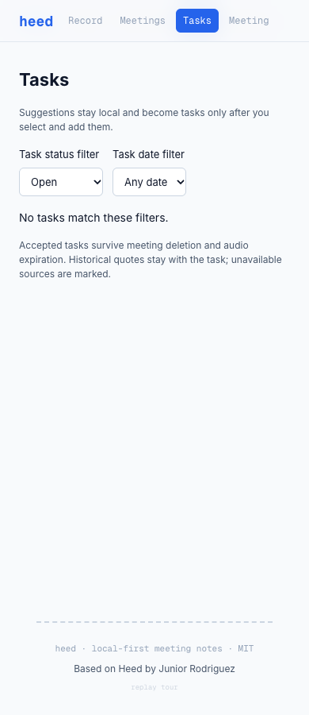
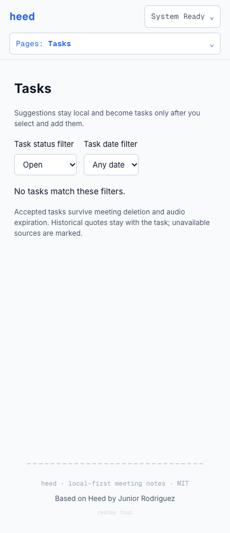
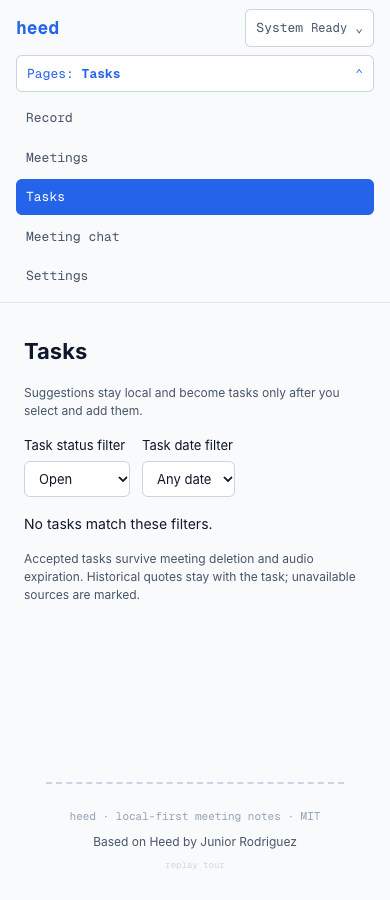
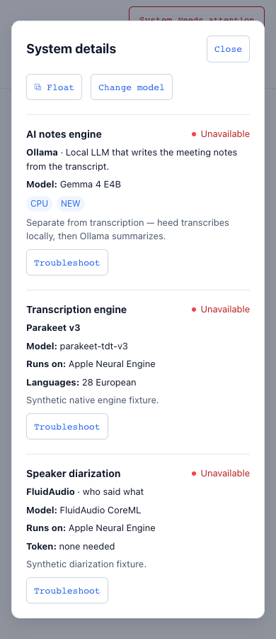

# Responsive header validation — issue #75

Validated on October 6, 2026, against baseline `965831b` and the issue branch. Screenshots and API responses use synthetic fixtures; no personal meetings, credentials or recordings appear in this evidence.

## Result

The header keeps all five destinations readable at desktop widths. Below 1024 CSS pixels, a named Pages disclosure displays the current destination and exposes every destination. Below 640 pixels, it occupies a deliberate second row. The header participates in document flow, including when the menu expands, so its height does not obscure main content.

System details keeps Float, model selection, full model names, CPU/NEW badges, engine/diarization information, readiness and the existing QuickFix actions accessible at every width. Status is expressed in text. Native modal dialogs provide Escape and focus return; operation and catalog errors appear inside the active dialog. Installed models have explicit keyboard-accessible selection buttons.

## Checks

| Check | Result |
| --- | --- |
| Client suite | 265 tests passed in 54 files, including 14 header integration tests |
| Production build | Passed; existing bundle-size warning remains |
| Server library suite | 494 tests passed in 77 files |
| Browser layout matrix | 288 combinations passed: four locales × three model-name cases × three health states × eight widths |
| Browser zoom | 24 checks passed: four locales × 125%/150%/200% actual Chrome host zoom × 640/1280 physical viewport pixels |
| Enlarged text | 24 checks passed: four locales × six widths with 200% root font size |
| Keyboard and behavior | All five full-app destinations, Settings content, Pages Escape/focus return, nested model picker and all QuickFix targets, explicit model selection, Float request and Start Ollama request passed |
| Mutation isolation | Layout/disclosure checks sent no mutation requests; only explicitly activated selection, Float and repair sent their corresponding requests. Existing read-only control polls and chat-context POSTs are handled separately. No recording or meeting/task mutation requests were sent. |
| Independent review | Error feedback inside the active dialog was added and verified; no unresolved actionable findings |
| Lint | Could not run: the existing ESLint 10 command has no `eslint.config.*` in the baseline repository. No lint configuration changes are included. |

CSS widths: 320, 390, 640, 768, 1024, 1280, 1440 and 1920px. Locales: English, Brazilian Portuguese, French and German. Model cases: normal name, long unbroken name and no selected model. Health cases: loading, healthy and unavailable. Browser zoom checks verify both the resulting CSS viewport width and device pixel ratio, using disposable Chrome profiles. The separate enlarged-text check caught and prevents the mobile menu wrapping into clipped columns.

The exhaustive matrix mounts the actual Nav and App layout with synthetic main content. Full-app checks navigate the existing pages at 390 and 1280px. HTTP responses are intercepted; model inference, physical recording and native window launching are not exercised by this header QA.

## Reproduce

Install the repository's locked dependencies and use installed Google Chrome. Start only the client from the issue checkout:

```sh
bun install --frozen-lockfile
bun run --cwd packages/client dev --host 127.0.0.1 --port 5175 --strictPort
```

In another terminal:

```sh
HEED_HEADER_QA_OUTPUT=/tmp/heed-header-qa node scripts/check-header-layout.mjs
NODE_OPTIONS=--no-experimental-webstorage bun run --cwd packages/client test
bun run build
bun test packages/server/lib
```

The browser check generates screenshots, matrix/zoom results and the explicit-action trace outside the repository. It intercepts all API paths, so a recording backend is unnecessary. `HEED_HEADER_QA_URL` can select another local Vite URL. `HEED_HEADER_QA_TEXT_ONLY=1` runs only the enlarged-text checks. To capture a baseline, run the check's `HEED_HEADER_QA_PHASE=before` mode against that baseline checkout.

## Screenshots

Desktop, 1280px:





Narrow window, 390px:







Error details with all three troubleshooting actions:


